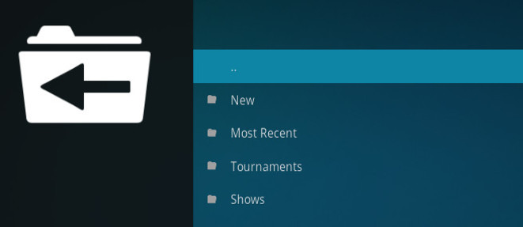

# sc2links

A [Kodi](https://kodi.tv/) plugin to provide access to the videos available via [sc2links.com](https://sc2links.com).

## Installation

Download the sources as zip file and install it. A tutorial on how to install 3rd-party add-ons is available [here](http://kodi.wiki/view/HOW-TO:Install_add-ons_from_zip_files).

**Note:** you may need to restart Kodi beforehand. 

To play the videos you'll probably also need to install the YouTube plugin.

## FAQ

What platforms are supported?

> The plugin is written in Python and should work on all platforms

What versions of Kodi are supported?

 - Krypton v17.x
 - older versions will probably work as well

## License

This software and documentation is available under the [MIT license](https://opensource.org/licenses/MIT)

